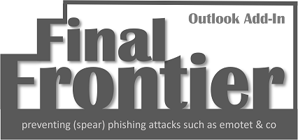

# 
FinalFrontier is an Outlook Add-In to detect and prevent (spear-) phishing attacks.

## The threat: Emotet & Co
Emotet has been the major threat for initial compromise. The attack always involves emails with malicious office documents with VBA as attachments or referred to with a link. With emotet using authentic emails for spear phishing, users are overwhelmed with recognizing such attacks.

## The solution: FinalFrontier Outlook Add-In
In my personal opinion, awareness does not work - typically companies spend a lot of time and money while the improvements are mostly limited. So... why don't we code the methods for recognizing phishy /malicious emails instead of teaching people? This is what FinalFrontier does as an Add-In for Outlook 2016.

## Detection mechanisms
Three levels:
* metadata, e.g. sender information and communication history
* links, e.g. (imho) bad TLDs, link shorteners, ...
* attachments, e.g. double extensions

More features such as machine learning, deeper attachment inspection, etc. are on the way.

## Installation
TODO

## Contact, supporting my development, full-fledged & customized versions
Please refer to Twitter (DM): @HolgerJunker or WWW: seculancer.de

The greatest help is to give feedback to me. Send me your feedback, ask questions or suggest features on GitHub, let me know about additions you have made to config and/or code. THX!

You have been saved from a malware infection thanks to FinalFrontier? Please feel free to give a spare dime/dollar/euro/... or two... It will be used to further enhance FinalFrontier and my other open source projects.

You can also support FinalFrontier and my other projects by donating hardware to keep operative backend and development systems running. Please take a look at (my list on, [amazon](https://www.amazon.de/hz/wishlist/ls/2FD1Z75K43I7M?ref_=wl_share))

## musical credits
major parts of FinalFrontier were designed and implemented while listening to the great music of Oomph! (@oomphband).
